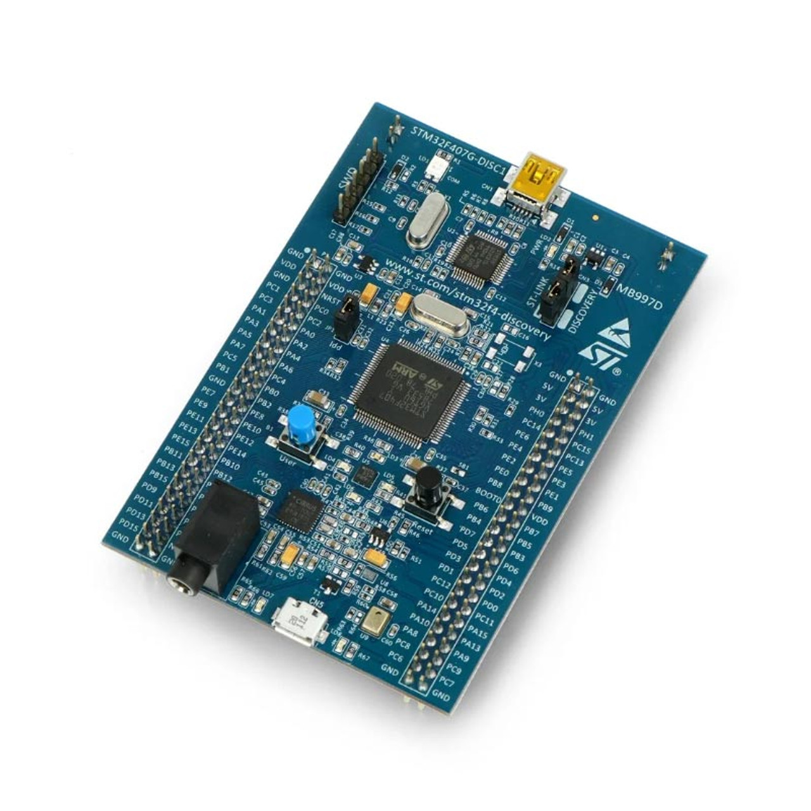

[← Previous: Build Instructions](../../docs/building.md) | [📖 Table of Contents](../../README.md) | [Next →: 2_serial](../2_serial/README.md)

---

# 1_blinky - Blinking an LED from Scratch

> *Part 1 of building a mini operating system from scratch on the STM32F407.*

## The Goal: A Mini OS, From Scratch

The end goal is to build a small operating system on an ARM Cortex-M4, the STM32F407. No vendor HAL. No libraries. No libc. Just a bare chip, a compiler, a flash programmer, and a reference manual.

But we have to start somewhere. And in embedded, "start somewhere" means blinking an LED.

## It Looks So Easy in Arduino

In Arduino, blinking an LED is five lines. `digitalWrite(LED, HIGH)`, upload, done.

But there's a lot happening behind the scenes that Arduino hides from you. What if we stripped all of that away? No libraries, no `setup()` and `loop()`. No "magic" button to upload the code into the microcontroller. How do you actually blink an LED?

Before we can schedule tasks or handle interrupts, we need to understand how this chip boots and how to talk to its hardware.



## What Happens When You Power On?

The processor doesn't just start running your code. It doesn't know where your code is. What it does is look at address `0x08000000`, the beginning of Flash, and expect a **vector table**: a list of addresses.

The hardware reads the first entry and loads it into the **Stack Pointer (SP)**. It reads the second entry, the **Reset Handler**, and loads it into the **Program Counter (PC)**, and begins execution from there.

```c
__attribute__((section(".isr_vector")))
uint32_t vector_table[] = {
    (uint32_t)&_estack,          // Initial Stack Pointer
    (uint32_t)&Reset_Handler,    // loaded into PC and start execution from there
    (uint32_t)&NMI_Handler,
    (uint32_t)&HardFault_Handler
    ...
};
```

No bootloader, no BIOS. The hardware itself fetches two addresses from Flash and starts running. That's the entire boot sequence.

## The Reset Handler

On a desktop, the C runtime sets up your environment before `main()` runs - it initializes the stack, copies initialized variables into memory, and zeros out the rest. On bare metal, there is no C runtime. We are the C runtime.

The stack is already taken care of - the hardware loaded it from the vector table. But we still need to set up memory:

1. **Copy `.data` from Flash to SRAM**: initialized globals live in Flash but need to be in SRAM
2. **Zero `.bss`**: the C standard says uninitialized globals start at zero

```c
void Reset_Handler(void) {
    uint32_t *src = &_etext;
    uint32_t *dst = &_sdata;
    while(dst < &_edata) {
        *dst++ = *src++;
    }

    uint32_t *bss = &_sbss;
    while(bss < &_ebss) {
        *bss++ = 0;
    }

    kmain();
    while(1);
}
```

The symbols `_etext`, `_sdata`, `_ebss` come from the **linker script**, a file that tells the linker exactly where to place code and data in memory. We'll elaborate it next.

Once memory is ready, the Reset Handler calls `kmain()` - our application entry point. That's where we take over.


## The Linker Script

The linker script tells the linker, a part of the compiler toolchain, exactly where to place each section in memory. Without it, the linker wouldn't know that code belongs in Flash and variables belong in SRAM.

The `MEMORY` block defines the two memory regions available on the STM32F407: 1MB of Flash at `0x08000000` and 128KB of SRAM at `0x20000000`:

```
MEMORY {
    FLASH (RX)  : ORIGIN = 0x08000000, LENGTH = 1024K
    SRAM  (RWX) : ORIGIN = 0x20000000, LENGTH = 128K
}
```

The `SECTIONS` block then lays out what goes where:

- **`.text`** → Flash: the vector table, all code, and read-only data.
- **`.data`** → SRAM: initialized global variables. Their initial values are stored in Flash, and the Reset Handler copies them to SRAM at startup.
- **`.bss`** → SRAM: uninitialized globals. The Reset Handler zeros this region.

The linker also generates symbols that mark the boundaries of each section: `_etext` (end of code in Flash), `_sdata` / `_edata` (start/end of `.data` in SRAM), `_sbss` / `_ebss` (start/end of `.bss`). These are the exact symbols the Reset Handler uses to know what to copy and what to zero.

## Toggling an LED

Now we're in `kmain()`. We want to blink an LED. The STM32F407 Discovery board has four built-in LEDs. Looking at the board's user manual, the green one is connected to pin 12 on GPIO port D (PD12).

GPIO (General Purpose Input/Output) is the peripheral that controls the pins. To toggle the LED, we need to flip PD12's output. But before we can touch any GPIO register, there's a catch.

## Enabling the Clock

On STM32, peripheral clocks are off by default. It's a power-saving feature called **clock gating**. If you try to use a GPIO port without enabling its clock first, nothing happens. No error, no crash, just silence.

The clock is enabled through the RCC (Reset and Clock Control) peripheral. GPIO port D sits on the AHB1 bus, so we set the corresponding bit in `RCC_AHB1ENR`:

```c
void gpio_init(uint32_t port) {
    RCC->AHB1ENR |= (1U << port);
}
```

One bit in one register. That's the difference between a dead port and a working one.

## Configuring the Pin

With the clock enabled, we can configure PD12 as an output. Each pin has a 2-bit mode field in the MODER register: `00` for input, `01` for output, `10` for alternate function, `11` for analog.

```c
void gpio_set_mode(GPIO_TypeDef *gpio, uint32_t pin, uint32_t mode) {
    gpio->MODER &= ~(3U << (pin * 2));    // Clear
    gpio->MODER |=  (mode << (pin * 2));   // Set
}
```

Clear first, then set. This read-modify-write pattern shows up everywhere in embedded. You never want to accidentally change bits you didn't intend to touch.

Now we can toggle the LED by XOR-ing the pin's bit in the Output Data Register:

```c
void led_toggle(void) {
    GPIOD->ODR ^= (1U << 12);
}
```

## SysTick - First Step Toward an OS Timer

We can toggle the LED, but without a delay between toggles it would flip so fast we'd never see it blink. How do you "wait" on bare metal? There's no `sleep()` function. No OS to ask. We are the OS.

The Cortex-M4 has a built-in SysTick, a 24-bit countdown timer. We load it with a value, it counts down to zero, sets a flag, and we poll that flag. At 16 MHz, loading 16000 gives us exactly 1 millisecond per countdown.

For now we poll it. Later, this same timer will drive our scheduler.

```c
void systick_delay_ms(uint32_t delay) {
    SYSTICK->LOAD = 16000 - 1;  // 16 MHz / 16000 = 1ms
    SYSTICK->VAL = 0;
    SYSTICK->CTRL = (1U << 2) | (1U << 0);

    for (uint32_t i = 0; i < delay; i++) {
        while ((SYSTICK->CTRL & (1U << 16)) == 0);
    }
    SYSTICK->CTRL = 0;
}
```

## Putting It All Together

With all that in place, the application code is almost anticlimactic:

```c
void kmain(void) {
    led_init(); // enable GPIO clock, configure GPIO pin
    while(1) {
        led_toggle();
        systick_delay_ms(500);
    }
}
```

Initialize the LED (enable clock + set pin to output), then loop forever, toggling the pin every 500ms.

## Compiling and Flashing

The code is ready, but it's still just C files on our computer. We need to compile it into a binary and write it to the chip's Flash memory.

**OpenOCD** (Open On-Chip Debugger) handles the flashing. It talks to the ST-LINK programmer built into the Discovery board over USB, and writes our compiled `.elf` file directly into Flash.

We automate the whole process with a Makefile. One command to compile, one to flash:

```bash
make APP=1_blinky
make flash APP=1_blinky
```

`make` compiles all source files and links them using our linker script. `make flash` calls OpenOCD to program the board. No IDE, no GUI. Just the terminal.


## What We Built

To blink one LED, we had to:

1. Write a vector table so the CPU knows where to start
2. Write a Reset Handler to initialize memory
3. Write a linker script to map Flash and SRAM
4. Enable the peripheral clock
5. Configure a GPIO pin as output
6. Set up SysTick for timing
7. Toggle a bit in a register in a loop

That's the difference between "it just works" and understanding what's actually happening. Arduino does all of this for you silently. Now we own it.

| Layer | Component |
|-------|-----------|
| Platform | startup.c, linker.ld, regs.h |
| HAL | GPIO, SysTick |
| Driver | LED |

## What's Next

We can control hardware and we have a sense of time. But we're flying blind. If something goes wrong, the LED can only tell us "yes" or "no." Next: **UART serial output**, our `printf` on bare metal.

---

[← Previous: Build Instructions](../../docs/building.md) | [📖 Table of Contents](../../README.md) | [Next →: 2_serial](../2_serial/README.md)
