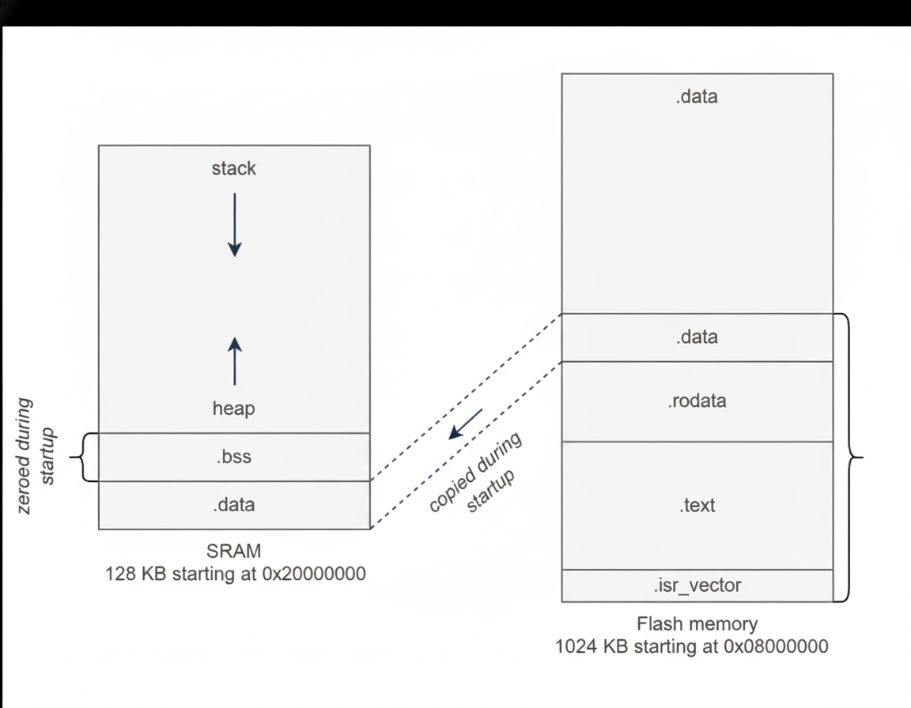

[← Previous: Build Instructions](../../docs/building.md) | [📖 Table of Contents](../../README.md) | [Next →: 2_serial](../2_serial/README.md)

---

# 1_blinky - Blinking an LED from Scratch

> *Part 1 of building a mini operating system from scratch on the STM32F407.*

## The Goal: A Mini OS, From Scratch

The end goal is to build a small operating system on an ARM Cortex-M4, the STM32F407. No vendor HAL. No RTOS. No Arduino. Just the reference manual, a compiler, and bare metal.

But we have to start somewhere. And in embedded, "start somewhere" means blinking an LED.

## It Looks So Easy in Arduino

In Arduino, blinking an LED is five lines. `digitalWrite(LED, HIGH)`, upload, done.

But there's a *lot* happening behind the scenes that Arduino hides from you. What if we stripped all of that away? No libraries, no `setup()` and `loop()`. Just a bare chip and a compiler. How do you actually blink an LED?

Before we can schedule tasks or handle interrupts, we need to understand how this chip boots and how to talk to its hardware.


## What Happens When You Power On?

The processor doesn't just start running your code. It doesn't know where your code *is*. What it does is look at address `0x08000000`, the beginning of Flash, and expect a **vector table**: a list of addresses.

First entry: initial stack pointer. Second entry: the **Reset Handler**, the first function that runs after power-on.

```c
__attribute__((section(".isr_vector")))
uint32_t vector_table[] = {
    (uint32_t)&_estack,          // Initial Stack Pointer
    (uint32_t)&Reset_Handler,    // Reset Handler - entry point
    (uint32_t)&NMI_Handler,
    (uint32_t)&HardFault_Handler
};
```

"Here's your stack, here's where to start." That's it. No bootloader, no BIOS. Just a table of addresses in Flash.


## The Reset Handler

On a desktop, the C runtime sets up your environment before `main()` runs. On bare metal, there is no C runtime. *We* are the C runtime.

Before any C code with globals can run, we need to set up memory:

1. **Copy `.data` from Flash to SRAM**: initialized globals live in Flash but need to be in SRAM
2. **Zero `.bss`**: the C standard says uninitialized globals start at zero

```c
void Reset_Handler(void) {
    uint32_t *src = &_etext;
    uint32_t *dst = &_sdata;
    while(dst < &_edata) {
        *dst++ = *src++;
    }

    uint32_t *bss = &_sbss;
    while(bss < &_ebss) {
        *bss++ = 0;
    }

    kmain();
    while(1);
}
```

The symbols `_etext`, `_sdata`, `_ebss` come from the **linker script**, a file that tells the linker exactly where to place code and data in memory.



## The Linker Script

The STM32F407 has 1MB of Flash at `0x08000000` and 128KB of SRAM at `0x20000000`:

```
MEMORY {
    FLASH (RX)  : ORIGIN = 0x08000000, LENGTH = 1024K
    SRAM  (RWX) : ORIGIN = 0x20000000, LENGTH = 128K
}
```

Code goes in Flash, variables go in SRAM. The linker generates the `_etext`, `_sdata`, etc. symbols so the startup code knows where to copy things. The vector table, startup code, and linker script work together. They're the boot sequence of our mini OS.

## Enabling the Clock

Here's something that catches everyone the first time: on STM32, **peripheral clocks are off by default**. It's a power-saving feature called clock gating. If you try to use a GPIO port without enabling its clock, nothing happens. No error, no crash, just silence.

```c
void gpio_init(uint32_t port) {
    RCC->AHB1ENR |= (1U << port);
}
```

One bit in one register. That's the difference between a dead port and a working one.


## Configuring the Pin

Pin 12 on Port D needs to be an output. Each pin has a 2-bit mode field in the MODER register: `00` for input, `01` for output, `10` for alternate function, `11` for analog.

```c
void gpio_set_mode(GPIO_TypeDef *gpio, uint32_t pin, uint32_t mode) {
    gpio->MODER &= ~(3U << (pin * 2));    // Clear
    gpio->MODER |=  (mode << (pin * 2));   // Set
}
```

Clear first, then set. This read-modify-write pattern shows up everywhere in embedded. You never want to accidentally change bits you didn't intend to touch.

## SysTick - First Step Toward an OS Timer

How do you "wait" on bare metal? There's no `sleep()` function. No OS to ask. *We are* the OS.

The Cortex-M4 has a built-in **SysTick**, a 24-bit countdown timer. We load it with a value, it counts down to zero, sets a flag, and we poll that flag. At 16 MHz, loading 16000 gives us exactly 1 millisecond per countdown.

For now we poll it. Later, this same timer will drive our scheduler.

```c
void systick_delay_ms(uint32_t delay) {
    SYSTICK->LOAD = 16000 - 1;  // 16 MHz / 16000 = 1ms
    SYSTICK->VAL = 0;
    SYSTICK->CTRL = (1U << 2) | (1U << 0);

    for (uint32_t i = 0; i < delay; i++) {
        while ((SYSTICK->CTRL & (1U << 16)) == 0);
    }
    SYSTICK->CTRL = 0;
}
```

## Finally Blinking

With all that in place, the application code is almost anticlimactic:

```c
void kmain(void) {
    led_init();
    while(1) {
        led_toggle();
        delay();  // 500ms
    }
}
```

We initialize the LED (enable clock + set pin to output), then loop forever, toggling the pin every 500ms.

The toggle is done by XOR-ing the Output Data Register:

```c
void led_toggle(void) {
    GPIOD->ODR ^= (1U << 12);
}
```


## What We Built

To blink one LED, we had to:

1. Write a vector table so the CPU knows where to start
2. Write a Reset Handler to initialize memory
3. Write a linker script to map Flash and SRAM
4. Enable the peripheral clock
5. Configure a GPIO pin as output
6. Set up SysTick for timing
7. Toggle a bit in a register in a loop

That's the difference between "it just works" and understanding what's actually happening. Arduino does all of this for you silently. Now we own it.

| Layer | Component |
|-------|-----------|
| Platform | startup.c, linker.ld, regs.h |
| HAL | GPIO, SysTick |
| Driver | LED |


## What's Next

We can control hardware and we have a sense of time. But we're flying blind. If something goes wrong, the LED can only tell us "yes" or "no." Next: **UART serial output**, our `printf` on bare metal.

---

[← Previous: Build Instructions](../../docs/building.md) | [📖 Table of Contents](../../README.md) | [Next →: 2_serial](../2_serial/README.md)
